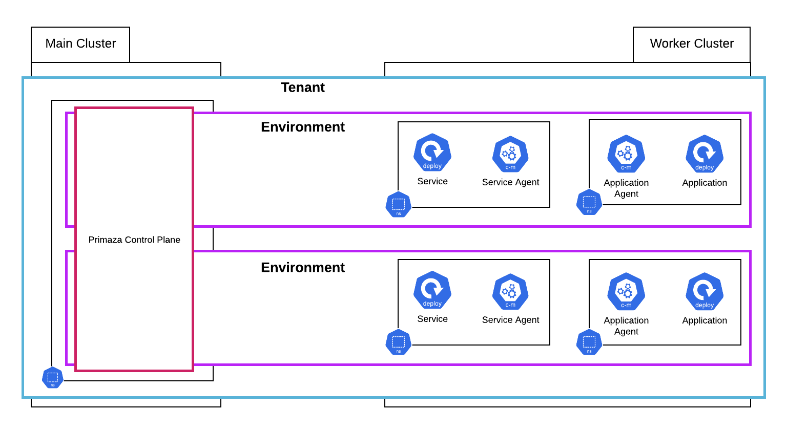

# :knot: Primaza

Primaza is a multi-cluster Service Consumption Framework.
Primaza is namespace-scoped and does not required any resource at cluster level other than its CRDs.

With Primaza you can create Primaza Tenants and link namespaces from multiple clusters.
These namespaces can be configured to allow primaza to Discover Services and/or Bind Services to applications.

Tenants are isolated and can be logically separated in Environments.
Environments are isolated from a point of view of a non-admin user.
Finally, services can be configured to be shared across Environments.

Please refer to [:blue_book: The Primaza Book](https://www.primaza.io) for a detailed explanation of internals.

For an easy setup of a Primaza tenant, please take a look at [primazactl](https://github.com/primaza/primazactl).

## Contributing and Code of Conduct

Discussions on new features happens in the [:left_speech_bubble: Repository's Discussions](https://github.com/primaza/primaza/discussions), feel free to contribute.

Also, refer to [CONTRIBUTING.md](./CONTRIBUTING.md) and [CODE_OF_CONDUCT.md](CODE_OF_CONDUCT.md) for contribution rules.
