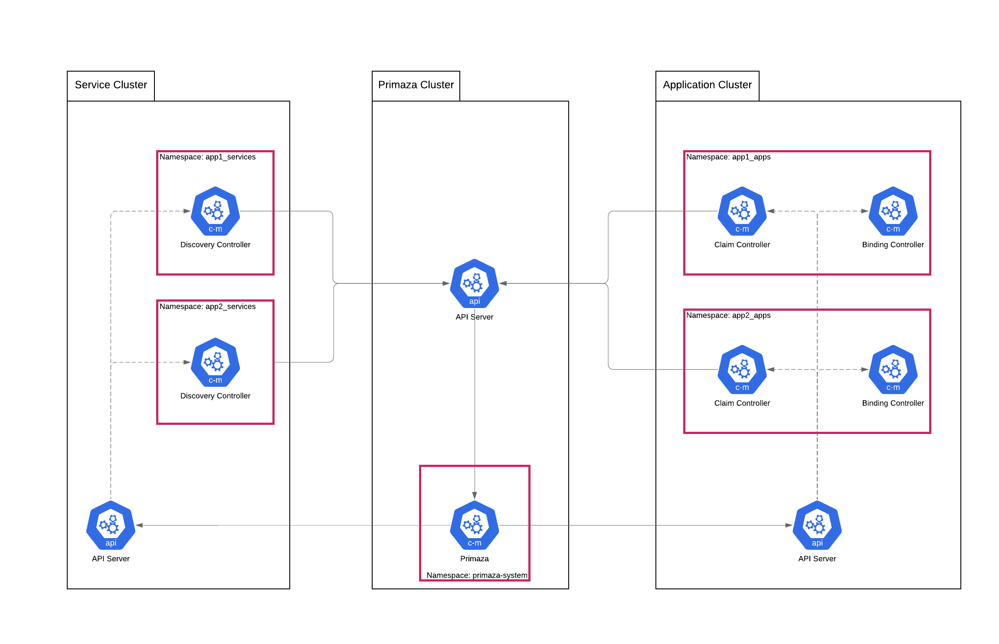

# Index
<!-- vim-markdown-toc GFM -->

* [Agents](#agents)
* [Configure Agents](#configure-agent)
* [Application agent](#application-agent)
    * [Binding a Service](#binding-a-service)
    * [Claiming a Service](#claiming-a-service)
        * [Claiming from Primaza cluster](#claiming-from-primaza-cluster)
        * [Claiming from Worker cluster](#claiming-from-worker-cluster)
* [Service agent](#service-agent)
    * [Service Discovery](#service-discovery)

<!-- vim-markdown-toc -->
# Agents

Primaza Agents are pushed into namespaces by Primaza.
Two kinds of Primaza Agents are defined:

* Application agent: is published into application namespaces and binds applications to services.
* Service agent: is published into service namespace and discovers services.

To allow agents to perform operations in the namespace, they need an identity (Service Account) with the right permissions.

[primazactl](https://github.com/primaza/primazactl) is an in-development companion tool to help administrators configuring clusters and namespaces.

# Configure agent

Application agent and Service agent deployent are configured in Primaza's Control Plane at runtime.
There exists a ConfigMap named `primaza-manager-config` in `primaza-system` namespace.

This ConfigMap consists of following keys:
    * `agentapp-image` : Application agent image
    * `agentsvc-image` : Service agent image
    * `agentapp-manifest` : Application agent manifest
    * `agentsvc-manifest` : Service agent manifest

By default the config map is populated using the make target `agents-configmap` executed at runtime.
This ConfigMap is used in `primaza-controller-manager` deployment as environment variables.
A user can modify the values of `primaza-manager-config` and then delete the `primaza-controller-manager` pod in `primaza-system` namespace.
This would reset the environment variables defined in  `primaza-manager-config` deployment.

# Application agent

Application agents are installed into Cluster Environment's application namespaces.
Namespaces on worker cluster need to be previously configured to allow, agents to run properly.
Application agents just need to access resources in the namespace they are published into.

More specifically, an application agent requires the following resources to exists into the namespace:

* A Role granting
    * full access to `leases.coordination.k8s.io`
    * read access to `servicebindings.primaza.io`
    * read access and update rights for `deployments.apps`
    * create right for `events`
* A Service Account for the agent
* A RoleBinding that binds the ServiceAccount to the Role

When a Service Binding is created in an application namespace, the Application Agent looks for resources mentioned in its specification.

Primaza Application Agent runs a dynamic informer for `Application` Resources mentioned in the Service Binding's specification.
The informer monitors changes to the `Application` matching the Service Binding specifications and updates the Service Binding's status accordingly.

* If the `Application` Resource mentioned in Service Binding specification is updated or created, the secret referenced by Service Binding resource will be projected into all the matching applications.
* If the `Application` Resource is deleted and no matching workloads are found in the namespace, then the Service Binding status condition `Reason` is updated to `NoMatchingWorkloads`.

## Binding a Service

<!-- TODO: -->

## Claiming a Service

<!-- TODO: -->

### Claiming from Primaza cluster

<!-- TODO: -->

### Claiming from Worker cluster

<!-- TODO: -->

# Service agent

Service agents are installed into Cluster Environment's service namespaces.
Namespaces on worker cluster need to be previously configured to allow, agents to run properly.
Service agents just need to access resources in the namespace they are published into.

More specifically, a Service agent requires the following resources to exists into the namespace:

* A Role granting
    * full access to `leases.coordination.k8s.io`
    * create right for `events`
* A Service Account for the agent
* A RoleBinding that binds the ServiceAccount to the Role

When a Service Class is created, the Service Agent looks for resources matching its specification.

A Role needs to be created which allows to retrive, list and watch Service Class Resources as Primaza Service Agent runs a dynamic informer for each resource.

The informer monitors changes to resources matching the Service Class specifications and updates the Registered Services on Primaza control plane.

## Service Discovery

<!-- TODO: -->

