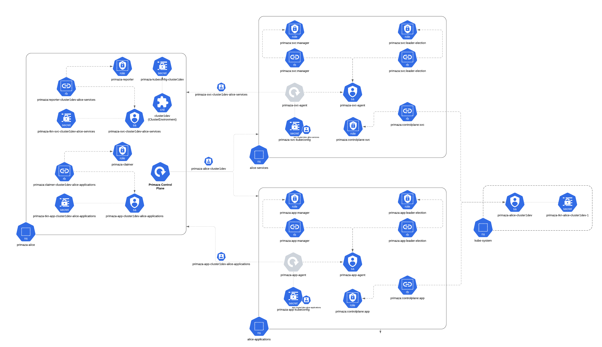

# Agents

Primaza Agents are pushed into namespaces by Primaza.
Two kinds of Primaza Agents are defined:

* Application agent: is published into application namespaces and binds applications to services.
* Service agent: is published into service namespace and discovers services.

To allow agents to perform operations in the namespace, they need an identity (Service Account) with the right permissions.

[primazactl](https://github.com/primaza/primazactl) is an companion tool to help administrators configuring clusters and namespaces.

# Configure agent

Application agent and Service agent deployment are configured in Primaza's Control Plane at runtime.
There exists a ConfigMap named `primaza-manager-config` in Primaza's Control Plane namespace.

This ConfigMap consists of following keys:
* `agentapp-image`: Application agent image
* `agentsvc-image`: Service agent image
* `agentapp-manifest`: Application agent manifest
* `agentsvc-manifest`: Service agent manifest

By default the config map is populated using the make target `agents-configmap` executed at runtime.
This ConfigMap is used in `primaza-controller-manager` deployment as environment variables.
An user can modify the values of `primaza-manager-config` and then delete the `primaza-controller-manager` pod in Primaza's Control Plane namespace.
This would reset the environment variables defined in  `primaza-manager-config` deployment.
