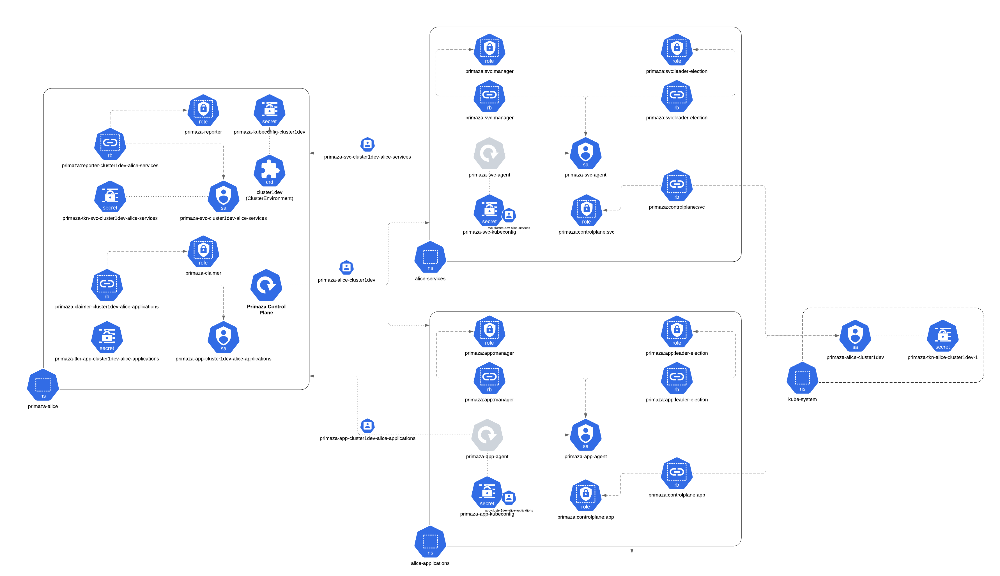

# Resources

In the following you find a list of all the resources needed for a Primaza Tenant.

## Tenant Namespace

The Tenant namespace is the namespace in which the Primaza Control Plane is installed.

### Control Plane

Resources created in the Primaza's Tenant namespace for executing the Primaza Control Plane:

* Primaza Control Plane's namespace is named after the tenant name: `<tenant>`
* Application Agent Role: `primaza-claimer`
* Service Agent Role: `primaza-reporter`

### Remote Cluster

Resources created in the Primaza Tenant namespace when a Remote cluster is joined to the Primaza Tenant:

* ClusterEnvironment: `<cluster environment name>`
* Kubeconfig Secret for ClusterEnvironment: `primaza-kubeconfig-<cluster environment name>`

###  Application Agent

Resources created in the Primaza Tenant namespace when an Application Namespace is configured:

* Application Agent's Service Account: `primaza-app-<cluster environment name>-<namespace>`
* Access Token Secret for Application Agent's Service Account: `primaza-tkn-app-<cluster environment name>-<namespace>`
* RoleBinding between Application Agent Service Account and Application Agent Role: `primaza:claimer-<cluster environment name>-<namespace>`

### Service Agent

Resources created in the Primaza Tenant namespace when a Service Namespace is configured:

* Service Agent's Service Account: `primaza-svc-<cluster environment name>-<namespace>`
* Access Token Secret for Service Agent's Service Account: `primaza-tkn-svc-<cluster environment name>-<namespace>`
* RoleBinding between Service Agent Service Account and Service Agent Role: `primaza:reporter-<cluster environment name>-<namespace>`

## Remote Cluster

Resources created in the Remote Cluster when it's joined to the Primaza Tenant:

* ClusterEnvironment's Service Account in namespace `kube-system`: `pmz-<tenant>-<cluster environment name>`
* Access Token Secret for ClusterEnvironment's Service Account in namespace `kube-system`: `tkn-pmz-<tenant>-<cluster environment name>`

## Application Namespace

Resources created in the Remote Cluster when an Application Namespace is configured:

* Service Account: `primaza-app-agent`
* Agent's Deployment: `primaza-app-agent`
* Kubeconfig Secret: `primaza-app-kubeconfig`
* Leader Election Role: `pmz:app:leader-election`
* Manager Role: `pmz:app:manager`
* Primaza's Role: `pmz:controlplane:app`
* Leader Election RoleBinding: `pmz:app:leader-election`
* Manager RoleBinding: `pmz:app:manager`
* Primaza's RoleBinding: `pmz:controlplane:app`

## Service Namespaces

Resources created in the Remote Cluster when a Service Namespace is configured:

* Service Account: `primaza-svc-agent`
* Agent's Deployment: `primaza-svc-agent`
* Kubeconfig Secret: `primaza-svc-kubeconfig`
* Leader Election Role: `pmz:svc:leader-election`
* Manager Role: `pmz:svc:manager`
* Primaza's Role: `pmz:controlplane:svc`
* Leader Election RoleBinding: `pmz:svc:leader-election`
* Manager RoleBinding: `pmz:svc:manager`
* Primaza's RoleBinding: `pmz:controlplane:svc`

