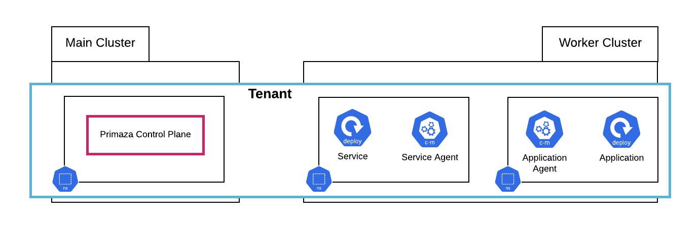

# Multi-Cluster Setup

In this tutorial we create the following Multi-Cluster environment using [primazactl](https://github.com/primaza/primazactl)

## Prerequisites

* [kind](https://github.com/kubernetes-sigs/kind)
* [primazactl](https://github.com/primaza/primazactl)

## Tutorial

{{#tutorial ../../../hack/tutorials/tenant/multi-cluster.sh}}
