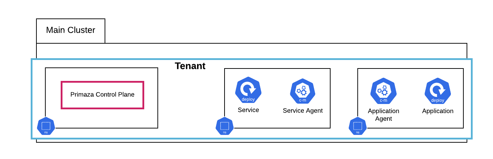

# Single Cluster Setup

In this tutorial you will create the following Single Cluster Primaza setup using [primazactl](https://github.com/primaza/primazactl)

## Prerequisites

* [kind](https://github.com/kubernetes-sigs/kind)
* [primazactl](https://github.com/primaza/primazactl)

## Tutorial

{{#tutorial ../../../hack/tutorials/tenant/single-cluster.sh}}
