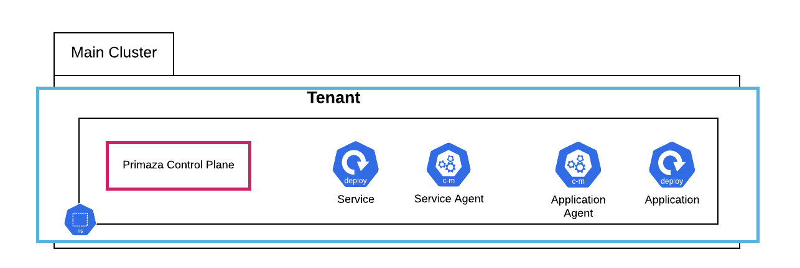

# Single-Namespace

In this tutorial you will create the following Single-Namespace Primaza setup using [primazactl](https://github.com/primaza/primazactl)

## Tutorial

{{#tutorial ../../../hack/tutorials/tenant/single-namespace.sh}}
